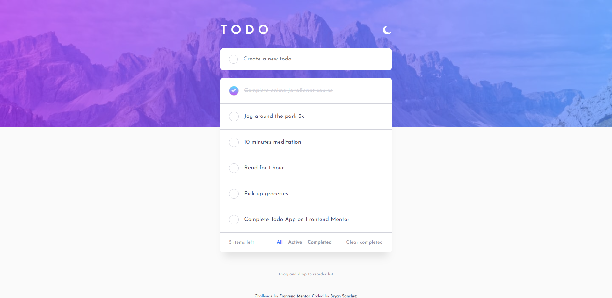

# Frontend Mentor - Todo app solution

This is a solution to the [Todo app challenge on Frontend Mentor](https://www.frontendmentor.io/challenges/todo-app-Su1_KokOW). Frontend Mentor challenges help you improve your coding skills by building realistic projects. 

## Table of contents

- [Overview](#overview)
  - [The challenge](#the-challenge)
  - [Screenshot](#screenshot)
  - [Links](#links)
- [My process](#my-process)
  - [Built with](#built-with)
  - [What I learned](#what-i-learned)
  - [Continued development](#continued-development)
  - [Useful resources](#useful-resources)
- [Author](#author)
- [Acknowledgments](#acknowledgments)

**Note: Delete this note and update the table of contents based on what sections you keep.**

## Overview

### The challenge

Users should be able to:

- View the optimal layout for the app depending on their device's screen size
- See hover states for all interactive elements on the page
- Add new todos to the list
- Mark todos as complete
- Delete todos from the list
- Filter by all/active/complete todos
- Clear all completed todos
- Toggle light and dark mode
- **Bonus**: Drag and drop to reorder items on the list

### Screenshot



### Links

- Solution URL: [GitHub](https://github.com/Bry-cmd/to-do-app-client)
- Live Site URL: [Heroku](https://bs-todo-app.herokuapp.com/)

## My process

### Built with

- Semantic HTML5 markup
- CSS custom properties
- Flexbox
- CSS Grid
- Mobile-first workflow
- [React](https://reactjs.org/) - JS library

### What I learned

1. Color theme switching
    
    The most prominent challenge from this design for me was implementing the color theme switcher between light and dark mode. My initial solution was based off of how I tackled creating different component stylings for mobile design and desktop design. That is, I create two different classes, one for light mode and one for dark mode.

    ```css
      .component--light {
        color: some-color;
      }

      .component--dark {
        color: some-other-color;
      }
    ```

    However, my problem with this was that I'd have to create two classes for each component, which would be pretty hectic. After some digging, I realized that I could use `CSS Custom Variables`, which are variables declared in the `:root` selector of the stylesheet.

    ```css
    :root {
      --light-color: rgb(255,255,255);
      --dark-color: rgb(0,0,0);
    }
    ```

    Once declared, these custom variables can be used on any component using `var()`.

    ```css
    .component {
      color: var(--light-color);
    }
    ```

    These custom variables' values can be accessed and changed using JavaScript.

    ```js
      // Getting a custom variable
      getComputedStyle(document.documentElement).getPropertyValue("--light-color");

      // Setting a custom variable
      document.documentElement.style.setProperty("--light-color", "rgb(250, 250, 250)");
    ```

    With these ideas in mind, I created a separate custom variable that would store the color of the component and just change that color to reflect the colors corresponding to light or dark mode

    ```css {
      :root {
        --light-color: rgb(255,255,255);
        --dark-color: rgb(0,0,0);

        --component-color: var(--light-color);
      }
    }
    ```

    ```js
      const toggleBtn = document.querySelector(".toggle__btn");
      var light = true;

      toggleBtn.addEventListener("click", () => {
        if (light) light = false;
        else light = true;
      })

      if (light) {
        document.documentElement.style.setProperty("--component-color",       getComputedStyle(document.documentElement).getPropertyValue("--light-color"));
      } else {
        document.documentElement.style.setProperty("--component-color",       getComputedStyle(document.documentElement).getPropertyValue("--dark-color"));
      }
    ```
2. useEffect() alternative for updating variables

    During this project, I realized that the `useState()` function of React can't be used in `useEffect()`. From what I understand so far, `useEffect()` is called once all the components have been rendered while `useState()` causes a change in said components. By using `useState()` in `useEffect()`, I end up creating an infinite loop that causes the site to break.

3. Drag and drop elements

    Next to the color theme switcher, learning how to drag and drop elements was something I found to be extremely challenging because I haven't done it before. However, after following along a tutorial by *Web Dev Simplified* (video in the references below), I was able to implement the functionality. I won't be placing the code here because it's all laid out and explained with comments in the `Tasks.js` file so I could easily revisit it and recall how it works because it's a really useful functionality.

4. Miscellaneous

    Among the major learnings listed above, my other learnings included how to use Redux and how to organize my React project files. I learned how to use Redux from an amazing video by *Dev Ed* and how to organize my project files from an insightful tutorial by *JavaScript Mastery*. Links to both videos are also listed in the resources section.

### Continued development

I want to learn how to incorporate other tools for Frontend Development such as Tailwind CSS and Next.js because I heard a lot of people recommending tools like these to improve my workflow. Although not related to Frontend challenges, I also want to start incorporating backend technologies so that I can finally create a full stack application.

### Useful resources

- [Web Dev Simplified Drag and Drop Tutorial](https://www.youtube.com/watch?v=jfYWwQrtzzY) - This tutorial taught me how to implement the drag and drop feature functionality used in this challenge. I recommend this channel's other videos as well because they're really informative and comprehensive.
- [Dev Ed Redux Tutorial](https://www.youtube.com/watch?v=CVpUuw9XSjY) - This amazing video taught me everything I know about Redux so far. It's perfect for beginners (like me) and it also shows how to implement Redux in React projects.
- [JavaScript Mastery MERN Stack Tutorials](https://www.youtube.com/watch?v=ngc9gnGgUdA&list=PL6QREj8te1P7VSwhrMf3D3Xt4V6_SRkhu) - This playlist showed me how all the different technologies in the MERN stack work and fit together to create a fully functioning website. These tutorials also taught me how to organize my project files so that they're easily scalable and are easy to manage.
- [CSS Tricks](https://css-tricks.com/) - This is a great website that has saved me a lot of times whenever I get confused on how to use flexbox and grid.
- [StackOverflow](https://stackoverflow.com/) - This is a great site that has answers to almost any question I can think of when it comes to programming.
- [React Official Site](https://reactjs.org/) - The official docummentation of React has been an extremely useful site for getting my React project up and running.
- [W3Schools](w3schools.com) - A great site that contains a lot of information about web development in bite-sized chunks. I found this really useful in helping me remember the syntax for something simple I want to implement (e.g. how to attach a keyboard event listener to an input element).

## Author

- GitHub - [Bry-cmd](https://github.com/Bry-cmd)
- Frontend Mentor - [@Bry-cmd](https://www.frontendmentor.io/profile/Bry-cmd)
- LinkedIn - [Bryan Sanchez](https://www.linkedin.com/in/bryan-sanchez-b316b7203/)

## Acknowledgments

A big thanks to [@denielden](https://www.frontendmentor.io/profile/denielden) for pointing out some features in the site which were lacking and some bugs that needed fixing!